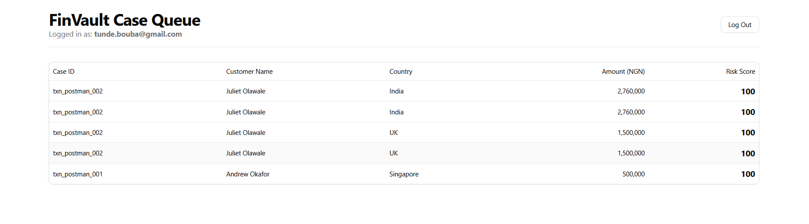
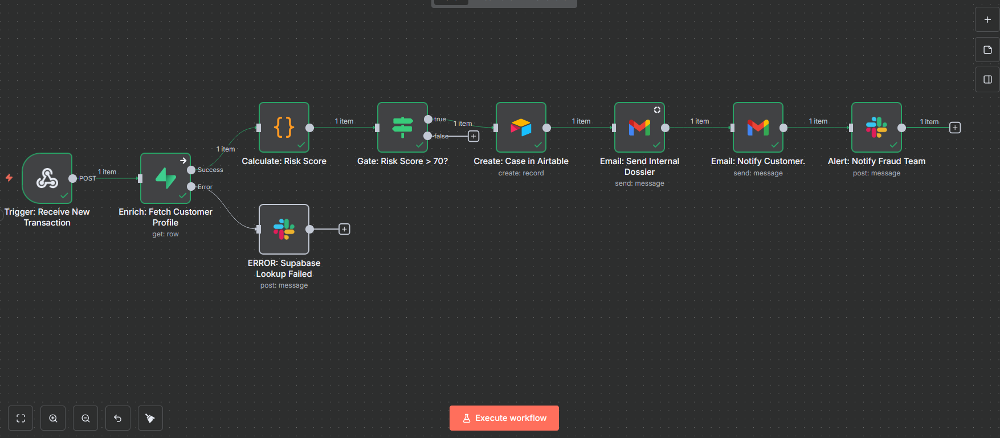
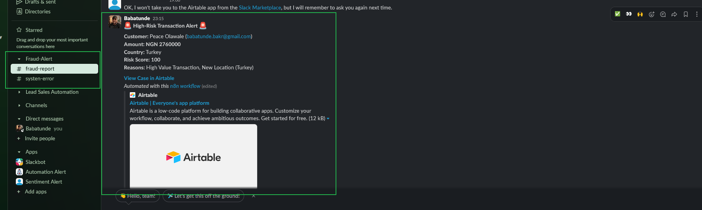

# FinVault - AI-Powered Transaction Monitoring & Case Management System

**FinVault is an advanced, AI-ready automation system designed to provide real-time transaction monitoring, intelligent fraud detection, and a complete case management dashboard for digital banking institutions.**

This project shifts fraud detection from a slow, reactive, manual review process into a proactive, automated, and context-rich decision-making workflow.

---

### The Problem: The Analyst's Dilemma

In the world of digital finance, fraud and financial crime evolve faster than traditional systems can handle. Fraud analysis teams are overwhelmed by a high volume of low-quality alerts (false positives), forcing them to spend most of their time on manual, "swivel-chair" analysis across multiple disconnected systems. This lost time delays the identification of genuine threats, increases financial losses, and creates a high-pressure, inefficient work environment.

### The Solution: An Automated Guardian

FinVault acts as an intelligent, automated co-pilot for fraud analysts. It ingests every transaction in real-time, enriches it with historical customer data from a Supabase database, applies a multi-factor risk-scoring algorithm, and, upon detecting a high-risk event, triggers a complete, orchestrated response—all within seconds.

The system culminates in a secure, custom-built React dashboard that serves as the analyst's single source of truth, allowing them to investigate and resolve cases with unparalleled efficiency.

---

### Key Features

- **Real-Time Ingestion:** A secure n8n webhook ingests transaction data from any payment gateway.
- **Automated Data Enrichment:** Instantly queries a Supabase (PostgreSQL) database to fetch customer historical profiles.
- **Multi-Factor Risk Scoring:** A dynamic, rules-based engine scores transactions based on value, location, frequency, and other factors.
- **Multi-Channel Alerting:** Triggers instant alerts via Slack and detailed email "dossiers" for internal teams upon threat detection.
- **Automated Case Creation:** Automatically generates a complete case file in an Airtable base, eliminating manual data entry.
- **Secure Analyst Dashboard:** A beautiful, intuitive React + Shadcn/ui application provides a real-time case queue, detailed investigation panels, and tools for case resolution.
- **Enterprise-Grade Authentication:** The dashboard is secured using Supabase Auth, ensuring only authorized team members can access sensitive data.

### Tech Stack & Architecture

FinVault is built on a modern, composable architecture, with each component chosen for its specific strengths.

- **Orchestration (The Brain):** **n8n** is the central nervous system, running the core business logic, connecting services, and orchestrating the entire automated workflow.
- **Primary Database (The Library):** **Supabase (PostgreSQL)** serves as our permanent, relational database, storing historical customer and transaction data for robust analytical queries.
- **Case Management Backend (The File Cabinet):** **Airtable** acts as the user-friendly backend for our active case management system, leveraged for its flexible API and collaborative interface.
- **Frontend (The Cockpit):** A custom **React (Vite + TypeScript)** application built with **TailwindCSS** and the **Shadcn/ui** component library provides a fast, secure, and intuitive user interface for analysts.
- **Authentication (The Gatekeeper):** **Supabase Auth** provides a secure, enterprise-grade solution for managing user logins and protecting the dashboard.

---

### Core Automation Engine (n8n)

The true business logic and orchestration of FinVault resides in two key, event-driven n8n workflows.

#### Workflow 1: Real-Time Transaction Processor & Scorer

This is the primary workflow that acts as the system's frontline guardian. It is a multi-step pipeline that receives, analyzes, and acts on every incoming transaction.

**Core Stages:**

1.  🚀 **Trigger:** A Webhook node provides a unique, secure endpoint to receive real-time transaction data.
2.  📚 **Enrich:** A Supabase node connects to our historical database, fetching the customer's profile and transaction history to add critical context.
3.  🧠 **Score:** A Code node executes our custom JavaScript risk algorithm, calculating a numerical `risk_score` based on business rules.
4.  🚦 **Gate:** An IF node acts as a decision gate. Low-risk transactions end here. High-risk transactions are passed on for action.
5.  📢 **Respond:** In a parallel path, the workflow executes the full response: creating a formal case in Airtable, sending a real-time Slack alert, and dispatching internal and external email notifications.

#### Workflow 2: Case Status Feedback Loop

This workflow provides real-time visibility into the human side of the investigation process, creating a closed-loop system.

**Core Stages:**

1.  👂 **Listen:** An Airtable Trigger node constantly listens for any updates made to a case record.
2.  🤔 **Decide:** A Switch node reads the new `Status` of the case (e.g., "Under Investigation").
3.  ✅ **Notify:** A Slack node sends a formatted message to the team, announcing the progress of the investigation and keeping everyone in sync.

---

### Getting Started

#### Prerequisites

- Node.js and pnpm
- An n8n instance (Cloud or self-hosted)
- A Supabase account (free tier)
- An Airtable account (free tier)
- A Slack workspace
- A Gmail account (or other SMTP provider)

#### Installation & Setup

1.  **Backend Setup:**

    - **Supabase:** Create a new project. Use the SQL schema in this repository to create the `customers` and `transactions` tables. Enable the Auth provider.
    - **Airtable:** Create a new base named `FinVault Case Management` with a `Cases` table using the schema defined in the technical documentation.

2.  **Middleware Setup (n8n):**

    - Import the two workflow JSON files from this repository into your n8n instance.
    - Create credentials within n8n for Supabase, Airtable, Slack, and your email provider.
    - Activate the workflows.

3.  **Frontend Setup:**
    - Navigate to the `finvault-dashboard` directory.
    - Create a `.env` file by copying the `.env.example`.
    - Fill in all the required API keys and URLs from your Supabase and Airtable projects.
    - Install dependencies: `pnpm install`
    - Run the development server: `pnpm dev`

### Future Roadmap

This project represents a complete and robust V1. Future enhancements could follow two main paths:

- **The Intelligence Path:** Adding advanced analyst tools like universal case filtering, case assignment, and an investigation notes/commenting system.
- **The Fortress Path:** Implementing a full audit trail for compliance and introducing role-based access control (RBAC) to differentiate between analyst and manager permissions.
