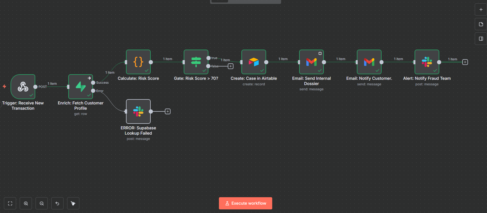

# FinVault - Technical Documentation

### Automation Title

FinVault - Real-Time Fraud Detection & Case Management System

### Category

Operations, Financial Technology (FinTech), Security

### Image/Thumbnail

### Detailed Description

FinVault is a comprehensive automation system designed for digital banking institutions to combat financial fraud and streamline investigation workflows. The core business problem it addresses is the operational inefficiency and high financial risk associated with legacy fraud detection systems. These systems produce a high volume of false positives, forcing skilled fraud analysts to spend the majority of their time on manual, repetitive data gathering across disconnected platforms, which delays the identification of genuine threats.

The FinVault system solves this problem by creating a high-speed, automated pipeline that sits between transaction processing and human analysis. It ingests every transaction in real-time, instantly enriches it with the customer's historical data (e.g., average transaction value, known locations), and applies a multi-factor risk-scoring algorithm. This transforms a simple transaction into an intelligence-rich event.

For high-risk events, the system's true power is unleashed. It triggers a multi-channel response: an immediate alert to the fraud team's Slack for awareness, an automated case creation in an Airtable backend for tracking, and detailed email notifications for internal archiving and external customer advisement. The expected outcome is a dramatic reduction in threat detection time (from hours to seconds), a >90% decrease in manual data-gathering effort for analysts, and a significant improvement in the quality of alerts, ultimately reducing financial losses and enhancing customer security.

### How It Works (Functionality)

The system is composed of two primary automation workflows, both orchestrated by n8n, which feed a custom React user interface.

**Workflow 1: Transaction Ingestion & Alerting**

This workflow processes new financial transactions in a real-time, event-driven pipeline.

- **1. Trigger (Webhook Node):** The workflow begins when an external service (e.g., a payment gateway) sends a `POST` request with JSON data to this node's unique URL.
- **2. Enrich (Supabase Node):** Using the `customer_id` from the webhook data, this node performs a `SELECT` operation on our Supabase PostgreSQL database. It queries the `customers` table to retrieve the customer's historical profile, specifically their `average_transaction_value` and their array of `known_locations`.
- **3. Score (Code Node):** This node receives the merged data from the previous steps. It runs a custom JavaScript function that applies our business rules:
  - It checks if the transaction `amount` is > 4x the `customer_average`.
  - It checks if the transaction `country` is included in the `known_locations` array.
  - It calculates a final `risk_score` and appends it to the data object.
- **4. Gate (IF Node):** This node checks a single condition: `risk_score >= 70`.
  - If **FALSE**, the data goes down the 'false' path, and the workflow execution for this transaction stops.
  - If **TRUE**, the data is passed down the 'true' path to all subsequent action nodes.
- **5. Create Case (Airtable Node):** This node connects to the `FinVault Case Management` base. It performs a `Create` operation on the `Cases` table, mapping the data from the workflow (Case ID, Customer Name, Risk Score, etc.) to the appropriate fields.
- **6. Alert Team (Slack Node):** This node sends a formatted message to a predefined channel (e.g., `#fraud-alerts`). The message body is dynamically populated with expressions referencing data from the workflow, including a direct link to the Airtable record created in the previous step.
- **7. Send Dossier (Gmail/Email Node):** This node sends a detailed HTML email to an internal distribution list, serving as a formal record of the case.
- **8. Notify Customer (Gmail/Email Node):** This node sends a separate, carefully worded HTML email to the customer, informing them of the suspicious activity.

**Workflow 2: The Feedback Loop**

This workflow provides real-time visibility into the analyst's actions in the dashboard.

- **1. Trigger (Airtable Trigger Node):** Configured to "On Record Updated," this node watches the `Cases` table and activates instantly when any field is changed.
- **2. Logic (Switch Node):** This node inspects the `Status` field from the updated Airtable record. It has multiple output paths, one for each potential status (`Under Investigation`, `Closed - Legitimate`, etc.).
- **3. Notify (Slack Node):** Depending on the path taken from the Switch node, a corresponding message is sent to a team channel (e.g., `#fraud-investigations`) to announce the case's progress.

### Tools Required

- **Orchestration:** n8n (Cloud or self-hosted)
- **Databases:** Supabase (PostgreSQL), Airtable
- **Alerting/Notifications:** Slack, Gmail (or any SMTP provider)
- **Frontend Application:** React, Vite, TailwindCSS, Shadcn/ui

### Size of project

**LARGE**. The primary n8n workflow consists of 7 core steps (Trigger, Fetch, Score, Gate, Create Case, Slack Alert, Email). The React frontend is a multi-component application with its own state management, API services, and authentication flow.

### Setup Requirements

The following non-personal credentials are required for deployment, to be stored in the appropriate `.env` files:

- Supabase Project URL, Anon Key
- Airtable Personal Access Token, Base ID, Table ID
- OAuth credentials for n8n to connect to Slack and Gmail

### Deployment Time Estimate

- **Without Customization:** For a technical user with existing accounts, initial setup and deployment is estimated at **2-3 hours**.
- **With Customization:** (e.g., adjusting risk rules, modifying email templates) estimated at **1-2 days**.

### Value Proposition

This automation directly reduces operational expenditure by minimizing the hours spent on manual fraud investigation. Assuming a fraud analyst spends 15 minutes per alert on manual data gathering and receives 20 high-risk alerts per day, FinVault saves approximately **5 hours of manual work per analyst, per day**. This frees up skilled analysts to focus on complex, high-value investigation rather than repetitive data entry.

### Demo Video

[Demo Video Link](https://drive.google.com/file/d/1TwaiTG_1DyTbsmNmuzBefZspa5AeMnhO/view?usp=sharing)

### Known Limitations

- The system's throughput is dependent on the API rate limits of the connected services' free tiers (n8n, Airtable, Supabase).
- The initial risk-scoring algorithm is rules-based and does not yet incorporate machine learning for predictive analysis.
- The authentication system does not yet feature role-based access control (RBAC).

### Testimonials/Use Cases

**Primary Use Case: "David," the Fraud Analyst**

- **Before:** David is stressed, spending his day copy-pasting transaction IDs and customer details between 3-4 different systems for every single alert. He feels like a data entry clerk, not an investigator.
- **After:** David opens his FinVault dashboard and sees a prioritized queue. He clicks a case, and all the information he needs is already there in a clean, intuitive panel. He makes a decision, clicks a button, and moves to the next case in seconds. He feels empowered and efficient.

### Size Classification

**Custom (>10)**. The project involves two backend automation workflows, a complete frontend application, and integration between 5 distinct tools/platforms.

### Estimated ROI

The Return on Investment is significant, primarily from saved labor costs.

- **Assumptions:**
  - Hours saved per month: `5 hours/day * 20 workdays = 100 hours`
  - Blended hourly rate for a fraud analyst: `$40/hour`
  - Monthly subscription costs (scaled tiers): `~$50`
- **Calculation:** `(100 hours * $40/hour) - $50 = $3,950 per month` in estimated operational savings per analyst.

### Version & Updates

- **v1.0.0 – Initial Release:** Complete end-to-end system with transaction ingestion, scoring, alerting, and an authenticated case management dashboard.
